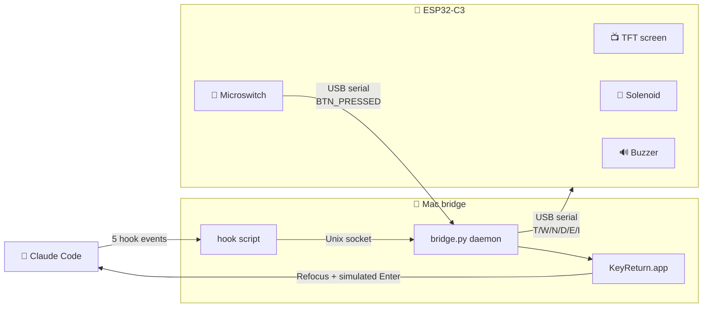

<div align="center">

# ClackClack

### *小克物理状态机*

A physical interface for Claude Code — see, hear, and touch your AI's state.

[](LICENSE)


<a href="README.en.md"></a>
<a href="README.md"></a>

<table>
  <tr>
    <td align="center" valign="middle">
      
    </td>
    <td align="center" valign="middle">
      
    </td>
  </tr>
</table>

</div>

---

## ✨ Features

|  |  |  |
|:---:|:---:|:---:|
| 🦀 **State at a glance** | 🔘 **One-button approval** | 🪟 **Cross-desktop focus** |
| 6 screen animations + magnet thump + buzzer melody — see what your AI is up to without looking | Press the physical button to auto-confirm Claude Code's permission dialog, no need to switch back | Even when focus is on another window or another macOS Space, the button precisely raises the right terminal |

## 🎬 Demo

### Press the hardware button to auto-confirm permission dialogs

https://github.com/user-attachments/assets/2f16e48c-3257-404d-8996-ac9e679ca264

### 6 states mapped to Claude Code's workflow

<div align="center">


*TFT screen + solenoid + buzzer all driven in lockstep*

</div>

<details>
<summary>Peek inside (exploded view)</summary>

<br/>

<div align="center">
  
</div>

The solenoid's plunger pushes against a 3D-printed cap — when triggered, the cap pops up then drops back, making a metallic clack-clack (hence the name). All components are wired to a breadboard via Dupont cables, easy to debug or swap.

</details>

## 🔌 How It Works



Events flow both ways: Claude Code's state pushes through hook → daemon → serial to the ESP32; button presses flow back through serial to the daemon, which uses macOS Accessibility APIs to simulate an Enter keypress and confirm the permission dialog.

## 📦 BOM

About **¥120 (~$17 USD)** total. Most parts from Taobao / Pinduoduo (Chinese consumer marketplaces); the printed enclosure is from JLC3DP. Western equivalents are widely available on AliExpress / Amazon.

| Module | Purpose | Price (¥) |
|--------|---------|-----------|
| ESP32-C3 SuperMini | Main MCU | 15 |
| 0.96" ST7735 TFT screen (80×160, SPI, 7-pin) | State display | 15 |
| IRF540N opto-isolated MOS module | Drives the solenoid | 10 |
| KK-0530B 5V push-pull solenoid | Physical alert | 15 |
| 3-pin low-trigger passive buzzer module | Audio alert | 5 |
| 4-pin 6×6mm microswitch | User button | 1 |
| Dupont jumpers + half-size breadboard | Wiring | 10 |
| 3D-printed enclosure (JLC3DP) | Housing / feel | 39 |
| USB-C data cable (data-capable, not power-only) | Flashing + connecting to Mac | own |

> [!WARNING]
> **The MOSFET module must be IRF540N or another logic-level MOSFET.** The standard IRF520 needs ≥10V Vgs and won't switch on the ESP32's 3.3V GPIO. This is the most common gotcha overlooked in Arduino tutorials.

## 🚀 Quick Start

### 1. Flash the firmware

Open `Arduino/claude_status/claude_status.ino` in Arduino IDE, then in Tools:

- **Board**: `ESP32C3 Dev Module`
- **USB CDC On Boot**: `Enabled`
- **Partition Scheme**: `Huge APP (3MB No OTA/1MB SPIFFS)` ← the default 1.25MB doesn't fit

The firmware bundles pixel data for all 6 state animations (`crab_data.h`) — no need to regenerate.

<details>
<summary>Want to modify the SVGs and regenerate animation data?</summary>

You'll need Python 3.11 + playwright + pillow + pygame. Recommended to set up a conda env:

```bash
conda create -n claude-device python=3.11
conda activate claude-device
pip install playwright pillow pygame pyserial
playwright install chromium

python build_assets.py    # SVG → Playwright sampling → palette quantization → RLE into build/crab_data.py
python build_h.py         # crab_data.py → Arduino/claude_status/crab_data.h
python simulator.py       # Desktop simulator, no hardware needed
# Re-upload firmware
```

</details>

### 2. Install the Claude Code plugin

Inside Claude Code (these are slash commands, not shell commands):

```
/plugin marketplace add <absolute path to repo>/xiaoke-local-plugin
/plugin install xiaoke-physical-statemachine@xiaoke-local
/plugin enable xiaoke-physical-statemachine
```

Python dependency: install `pyserial` into system python3 or any conda env (the daemon will auto-detect):

```bash
pip3 install pyserial
```

### 3. Start the Mac bridge daemon — automatic

Nothing to do. Next time you send a message to Claude Code, the hook fires → automatically calls `bridge.py --ensure` → generates the launchd plist + starts the daemon + compiles the KeyReturn.app helper.

> [!IMPORTANT]
> **One manual step**: The first time you press the hardware button, macOS pops up "KeyReturn wants to use Accessibility / Control X" — you must **toggle it on manually** in System Settings (macOS hard requirement, cannot be automated). See [xiaoke-local-plugin/daemon/README.md](xiaoke-local-plugin/daemon/README.md) for details.

### 4. Test

```bash
python test_device.py    # Manually cycle states over serial; press 1-6 to see each state + solenoid + buzzer
```

Or **just talk to Claude Code** — send a message and watch the screen flip to T; ask it to run a command that needs approval and watch it flip to N + the solenoid clacking; press the hardware button and watch the approval dialog auto-confirm.

## 🧬 State Mapping

| Claude event | Screen | Solenoid | Buzzer |
|--------------|--------|----------|--------|
| User submits input | 🟡 **T** Thinking (yellow bg, crab) | 🔇 | 🔇 |
| AI editing code | 🔵 **W** Writing (blue bg, typing) | 🔇 | 🔇 |
| AI waiting for approval | 🟠 **N** Notify (orange bg, alert) | clack-clack-clack-clack— | ding-ding-ding-dong~ |
| AI output complete | 🟢 **D** Done (green bg, flower) | clack! clack! | Mario coin chime |
| 6s timeout | ⚪ **I** Idle (gray bg, dozing) | 🔇 | 🔇 |

**Hardware button**:

- **Short press**: auto-switches to the Claude Code terminal window + sends Enter (confirms the N permission dialog)
- **Long press ≥800ms**: mute toggle (a gray speaker icon appears in the screen's bottom-right)

## 🔧 Wiring

| Component | ESP32 GPIO |
|-----------|-----------|
| TFT CS | GPIO10 |
| TFT RST | GPIO8 |
| TFT DC | GPIO7 |
| TFT SDA (MOSI) | GPIO5 |
| TFT SCL (SCLK) | GPIO6 |
| TFT VCC | 3.3V |
| TFT BL (backlight) | 3.3V |
| TFT GND | GND |
| Buzzer I/O | GPIO4 |
| Buzzer VCC | **3.3V** (not 5V — at 5V the module heats up and distorts the signal) |
| Buzzer GND | GND |
| MOS module SIG | GPIO2 |
| MOS module VCC | 3.3V (control side) |
| MOS module GND | GND |
| MOS module V+ | 5V (solenoid power) |
| MOS module V- | GND |
| Solenoid red wire | MOS module OUT+ |
| Solenoid black wire | MOS module OUT- |
| Microswitch one terminal | GPIO3 |
| Microswitch other terminal | GND |

When wiring, **verify each module on its own** — burn the corresponding single-module test sketch (in `Arduino/buzzer_test/`, `magnet_test/`, `switch_test/`) after each new component, before adding the next. Wiring everything at once makes faults hard to isolate.

## 💡 Design Notes

- **Solenoid = strong-alert signal**: Only fires on N (notify) / D (done) / E (error) — the three states needing user attention. T/W/I stay completely still. The "motion = importance" semantic.
- **Buzzer wired to 3.3V, not 5V**: At 5V the PNP transistor in the low-trigger module is half-on, heats up, and the signal distorts. At 3.3V the transistor fully cuts off — counterintuitively, the buzzer is louder.
- **MOSFET is IRF540N, not IRF520**: IRF520 needs ≥10V Vgs and won't turn on with a 3.3V GPIO. IRF540N is a logic-level MOSFET (note the "N" suffix) — that's why it works.
- **Done state auto-returns to Idle after 6s in firmware**: The hook only marks the completion event; returning to silence is maintained locally by the firmware. Even if hook timing is messy, the UX stays smooth.
- **Why a Mac bridge daemon?**: The ESP32-C3's USB-Serial-JTAG doesn't support HID (the button can't act as a USB keyboard), so the design uses a Mac daemon listening on serial + KeyReturn.app to simulate Enter. KeyReturn.app is a minimal helper compiled via `osacompile`, scoping macOS Accessibility permission to this "can only press Enter" tool — instead of the entire Python interpreter.

## 📁 File Structure

```
.
├── README.md / README.en.md               # 简体中文 / English
├── LICENSE                                # GPL-3.0
├── Arduino/                               # ESP32 firmware
│   ├── claude_status/                     # Integrated firmware (this is the one to flash)
│   ├── buzzer_test/ magnet_test/ switch_test/ magnet_freq_test/  # Per-module tests
│   ├── melody_compare/ notify_compare/    # Buzzer / N-alert candidate comparison tools
│   └── graphicstest_copy_*/               # TFT screen tuning sketches
├── xiaoke-local-plugin/                   # Claude Code plugin
│   ├── hooks/                             # Python hook entry + config
│   ├── daemon/                            # Mac bridge daemon (exclusive serial + simulated keypress)
│   │   └── README.md                      # daemon internals + debugging
│   └── README.md                          # Plugin install guide
├── assets/
│   ├── svg/                               # 6 state SVG sources (art assets)
│   └── media/                             # Photos + screen GIFs referenced by README
│       ├── photos/                        # Real-hardware photos
│       └── screens/                       # GIFs synthesized from pixel data
├── build_assets.py                        # SVG → Playwright sampling → palette quantization → RLE
├── build_h.py                             # crab_data.py → Arduino .h
├── simulator.py                           # Pygame screen simulator (see animations without flashing hardware)
├── dump_frames.py                         # Debug: decode RLE back to PNG
├── test_device.py                         # Serial test tool
└── cad/                                   # Enclosure CadQuery design + STL
```

## 📜 License

GPL-3.0, see [LICENSE](LICENSE).
