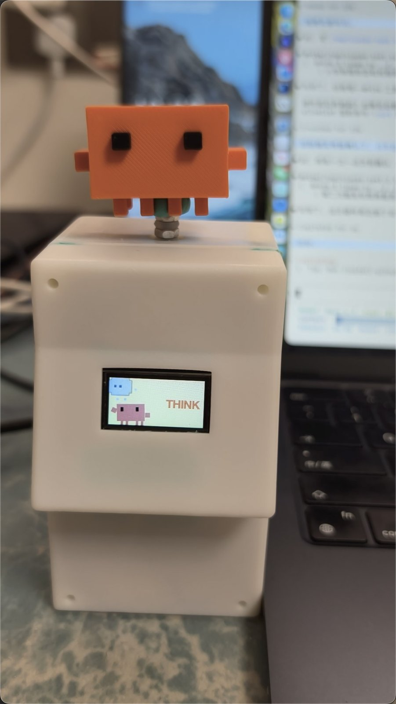
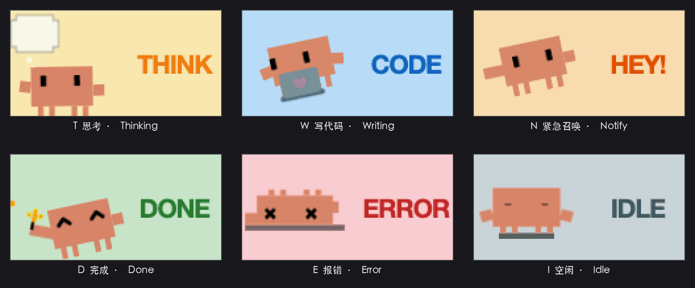
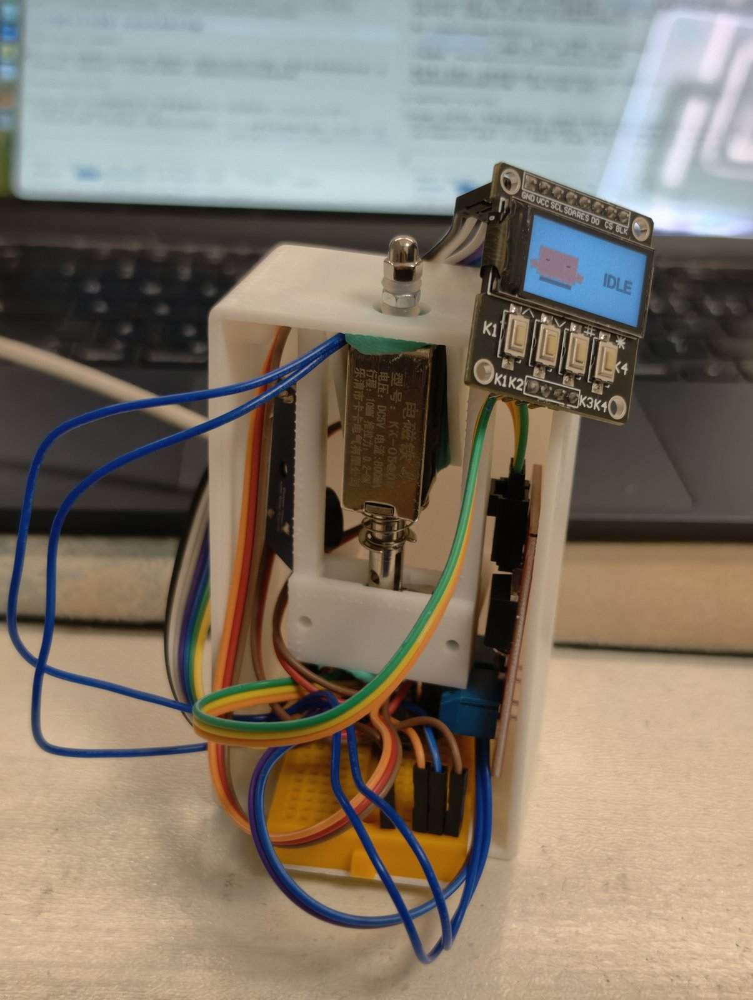
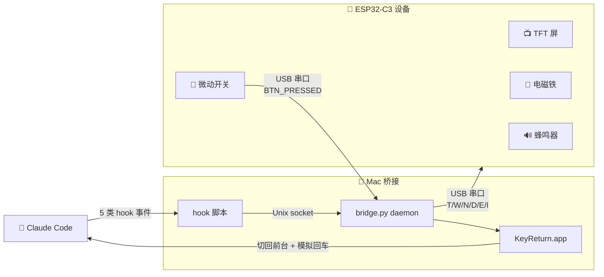

<div align="center">

# 小克物理状态机

### *ClackClack*

让 AI 的工作"看得见、听得见、摸得着"

[](LICENSE)


<a href="README.en.md"></a>
<a href="README.md"></a>

<table>
  <tr>
    <td align="center" valign="middle" width="50%">
      
    </td>
    <td align="center" valign="middle" width="50%">
      
    </td>
  </tr>
</table>

</div>

---

## ✨ 特性 Features

|  |  |  |
|:---:|:---:|:---:|
| 🦀 **状态可视化** | 🔘 **一键确认权限** | ↩️ **免手动切窗** |
| 6 种屏幕动画 + 电磁铁推杆 + 蜂鸣器旋律，AI 在干什么一眼看到 | 硬件按钮按一下，自动模拟回车 confirm 权限弹窗 | 焦点在别的 app、别的桌面都没事——按按钮自动切到终端 confirm，再切回你刚才那个 app |

## 🎬 Demo

### 按硬件按钮自动确认权限弹窗

https://github.com/user-attachments/assets/2f16e48c-3257-404d-8996-ac9e679ca264

### 6 种状态对应 Claude Code 的工作阶段

<div align="center">



*TFT 屏 + 电磁铁 + 蜂鸣器同步联动*

</div>

<details>
<summary>看看里面什么样子（拆开来的内部结构）</summary>

<br/>

<div align="center">
  
</div>

电磁铁的推杆顶在 3D 打印的小帽子上，触发时把帽子顶起来 → 落下，发出咔咔的金属声。所有元件都用杜邦线接到面包板上，方便调试和换件。

</details>

## 🔌 工作原理



事件流是双向的：Claude Code 的状态通过 hook → daemon → 串口推到 ESP32，硬件按钮的按下通过串口回报给 daemon，daemon 用 macOS 辅助功能模拟回车确认权限弹窗。

## 📦 硬件清单 BOM

人民币约 **¥120**，淘宝/拼多多 + 嘉立创 3D 打印都能买到。

| 模块 | 用途 | 价位（¥） |
|------|------|---------|
| ESP32-C3 SuperMini | 主控 | 15 |
| 0.96" ST7735 TFT 屏（80×160，SPI，7 针脚） | 状态画面 | 15 |
| IRF540N 光耦隔离 MOS 模块 | 驱动电磁铁 | 10 |
| KK-0530B 5V 推拉电磁铁 | 物理提醒 | 15 |
| 3 针脚低电平触发无源蜂鸣器模块 | 声音提醒 | 5 |
| 4 脚 6×6mm 微动开关 | 用户按钮 | 1 |
| 杜邦线 + 半尺寸面包板 | 接线 | 10 |
| 3D 打印外壳（嘉立创打印） | 装配 / 手感 | 39 |
| USB-C 数据线（支持数据传输的，不是只供电的） | 烧固件 + 接 Mac | 自备 |

> [!WARNING]
> **MOSFET 模块必须是 IRF540N 或其他逻辑电平 MOSFET**。标准 IRF520 需要 ≥10V Vgs，ESP32 GPIO 3.3V 驱动不开。这是 Arduino 教程圈最常被忽略的坑。

## 🚀 快速开始

### 1. 烧固件到 ESP32

用 Arduino IDE 打开 `Arduino/claude_status/claude_status.ino`，Tools 里选：

- **Board**: `ESP32C3 Dev Module`
- **USB CDC On Boot**: `Enabled`
- **Partition Scheme**: `Huge APP (3MB No OTA/1MB SPIFFS)` ← 默认的 1.25MB 装不下

固件已包含 6 个状态动画的像素数据（`crab_data.h`），不需要重新生成。

<details>
<summary>想改 SVG 自己生成动画数据</summary>

需要 Python 3.11 + playwright + pillow + pygame，建议放 conda 环境里：

```bash
conda create -n claude-device python=3.11
conda activate claude-device
pip install playwright pillow pygame pyserial
playwright install chromium

python build_assets.py    # SVG → Playwright 采样 → 调色板量化 → RLE 到 build/crab_data.py
python build_h.py         # crab_data.py → Arduino/claude_status/crab_data.h
python simulator.py       # 桌面模拟器看效果，不用烧设备
# 重新上传固件
```

</details>

### 2. 装 Claude Code 插件

在 Claude Code 里输入 slash 命令（不是终端命令）：

```
/plugin marketplace add <仓库绝对路径>/xiaoke-local-plugin
/plugin install xiaoke-physical-statemachine@xiaoke-local
/plugin enable xiaoke-physical-statemachine
```

Python 依赖：把 `pyserial` 装到系统 python3 或任意 conda 环境（daemon 会自动探测）：

```bash
pip3 install pyserial
```

### 3. 启 Mac 桥接 daemon —— 自动

什么都不用做。下次给 Claude Code 发消息触发 hook → hook 自动调 `bridge.py --ensure` → 自动生成 launchd plist + 启动 daemon + 编译 KeyReturn.app helper。

> [!IMPORTANT]
> **唯一手动步骤**：第一次按硬件按钮时 macOS 会弹"KeyReturn 想要使用辅助功能 / 控制 X"对话框 → 在系统设置里**手动勾上**（macOS 强制要求，无法自动）。详见 [xiaoke-local-plugin/daemon/README.md](xiaoke-local-plugin/daemon/README.md)。

### 4. 测试

```bash
python test_device.py    # 串口手动切状态，按 1-6 看各状态画面 + 电磁铁 + 蜂鸣器
```

或者**直接和 Claude Code 对话**——发个消息看屏切到 T；让它跑个需要权限的命令看屏切到 N + 电磁铁咔咔；按硬件按钮看是否自动确认权限。

## 🧬 状态映射

| Claude 事件 | 屏幕 | 电磁铁 | 蜂鸣器 |
|------|------|------|------|
| 用户提交输入 | 🟡 **T** 思考（黄底螃蟹） | 🔇 | 🔇 |
| AI 编辑代码 | 🔵 **W** 写代码（蓝底敲键盘） | 🔇 | 🔇 |
| AI 等用户批准 | 🟠 **N** 紧急召唤（橙底感叹号） | 咔咔咔 咔—— | 叮叮叮 咚~~ |
| AI 输出完成 | 🟢 **D** 完成（绿底花朵） | 咔！咔！ | 马里奥金币音 |
| 6 秒后超时 | ⚪ **I** 空闲（浅灰打盹） | 🔇 | 🔇 |

**硬件按钮**：

- **短按**：自动切到 Claude Code 终端窗口 + 发回车（确认 N 紧急召唤的权限弹窗）
- **长按 ≥800ms**：静音切换（屏右下角显示灰色喇叭图标）

## 🔧 接线

| 元件 | ESP32 GPIO |
|------|-----------|
| TFT CS | GPIO10 |
| TFT RST | GPIO8 |
| TFT DC | GPIO7 |
| TFT SDA (MOSI) | GPIO5 |
| TFT SCL (SCLK) | GPIO6 |
| TFT VCC | 3.3V |
| TFT BL（背光） | 3.3V |
| TFT GND | GND |
| 蜂鸣器 I/O | GPIO4 |
| 蜂鸣器 VCC | **3.3V**（不是 5V，5V 会让模块发热信号失真） |
| 蜂鸣器 GND | GND |
| MOS 模块 SIG | GPIO2 |
| MOS 模块 VCC | 3.3V（控制端） |
| MOS 模块 GND | GND |
| MOS 模块 V+ | 5V（电磁铁电源端） |
| MOS 模块 V- | GND |
| 电磁铁红线 | MOS 模块 OUT+ |
| 电磁铁黑线 | MOS 模块 OUT- |
| 微动开关 一端 | GPIO3 |
| 微动开关 另一端 | GND |

接线时**单模块逐个验证**——每接一个新元件就单独烧对应测试 sketch（在 `Arduino/buzzer_test/`、`magnet_test/`、`switch_test/` 这些目录里）跑通，再接下一个。一次接全很难定位故障。

## 💡 设计要点

- **电磁铁 = 强提醒信号**：只在 N（紧急召唤）/ D（完成）/ E（报错）三个需要用户介入的状态触发，T/W/I 完全静止。"动 = 重要"的语义。
- **蜂鸣器接 3.3V 而非 5V**：低电平触发模块的 PNP 三极管在 5V 时半导通发热 + 信号失真；接 3.3V 三极管完全截止，反而声音更响。
- **MOSFET 用 IRF540N 而非 IRF520**：IRF520 需要 ≥10V Vgs；3.3V ESP32 驱动不开。IRF540N 是逻辑电平 MOSFET（带 "N"）才行。
- **D 状态固件层 6 秒自动转 I**：hook 只标记完成事件，回归静默由固件本地维护，hook 时序乱不影响体验。
- **Mac 桥接 daemon**：ESP32-C3 的 USB-Serial-JTAG 不支持 HID（按钮当不了 USB 键盘），所以走 Mac daemon 监听串口 + 用 KeyReturn.app 模拟回车的方案。KeyReturn.app 是用 `osacompile` 编译出来的最小 helper，让 macOS 辅助功能权限范围收窄到这个 "只能按回车" 的工具（而不是整个 Python 解释器）。

## 📁 文件结构

```
.
├── README.md                              # 本文件
├── LICENSE                                # MIT
├── Arduino/                               # ESP32 固件
│   ├── claude_status/                     # 整合固件（主，烧这个）
│   ├── buzzer_test/ magnet_test/ switch_test/ magnet_freq_test/  # 单模块测试
│   ├── melody_compare/ notify_compare/    # 蜂鸣器 / N 召唤候选对比工具
│   └── graphicstest_copy_*/               # TFT 屏调校 sketch
├── xiaoke-local-plugin/                   # Claude Code 插件
│   ├── hooks/                             # Python hook 入口 + 配置
│   ├── daemon/                            # Mac 桥接 daemon（独占串口 + 模拟按键）
│   │   └── README.md                      # daemon 工作原理 + 调试
│   └── README.md                          # 插件安装说明
├── assets/
│   ├── svg/                               # 6 状态 SVG 源（美术资产）
│   └── media/screens/                     # 由像素数据合成的 GIF / 拼图，README 用
├── build_assets.py                        # SVG → Playwright 采样 → 调色板量化 → RLE
├── build_h.py                             # 生成的 crab_data.py → Arduino .h
├── simulator.py                           # Pygame 屏幕模拟器（不烧设备就能看动画）
├── dump_frames.py                         # 调试：反解码 RLE 出 PNG
├── test_device.py                         # 串口测试工具
└── cad/                                   # 外壳 CadQuery 设计 + STL
```

## 📜 License

GPL-3.0，详见 [LICENSE](LICENSE)。
